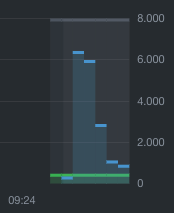

# k8s-health

## Test Environments

Tests done on an 8 core CPU; workloads deployed to 1 specific node.

### Deploying Docker Enterprise

Docker Enterprise was used for Swarm and Kubernetes tests; additional resource utilization is required to run the full platform so there is a resource utilization difference to Mesos based off of this fact.

### Deploying Mesos

Tests were done using Mesos Mini:

```
docker run -d --name mesos-mini --privileged -p 5050:5050 -p 5051:5051 -p 8080:8080 mesos/mesos-mini
```

Deploying the test 300 containers:

```
curl -X POST -d @mesos_healthcheck.json -H "Content-type: application/json" http://localhost:8080/v2/apps
```

## Test Results

### k8s no health check / no liveness probe

Deployed with `healthprobe_no_probe.yml`

Load average: `7.17, 34.59, 37.84`


### k8s livenessprobe (deployed via k8s)

Deployed with `healthprobe_livenessprobe.yml`

Load average: `7.28, 14.88, 30.85`


### docker health check (deployed via Swarm)

Deployed with `docker-compose-deploy-v3.yml`

Load average: `60.16, 52.17, 29.01`


### docker + mesos health check (deployed via Marathon)

Deployed with `mesos_healcheck.json`

Load average: `2.34, 10.88, 7.04`


