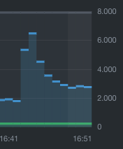
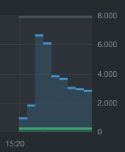
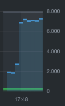

# k8s-health

## k8s no health check / no liveness probe

Deployed with `healthprobe_no_probe.yml`

Load average: `7.17, 34.59, 37.84`

## k8s livenessprobe (deployed via k8s)

Deployed with `healthprobe_livenessprobe.yml`

Load average: `7.28, 14.88, 30.85`

## docker health check (deployed via Swarm)

Deployed with `docker-compose-deploy-v3.yml`

Load average: `88.65 53.85 35.30`

